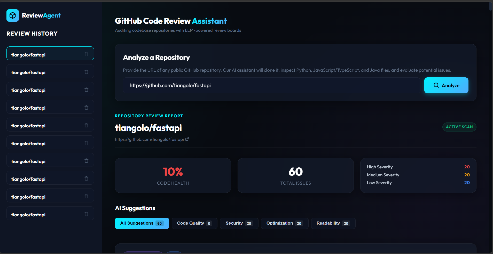
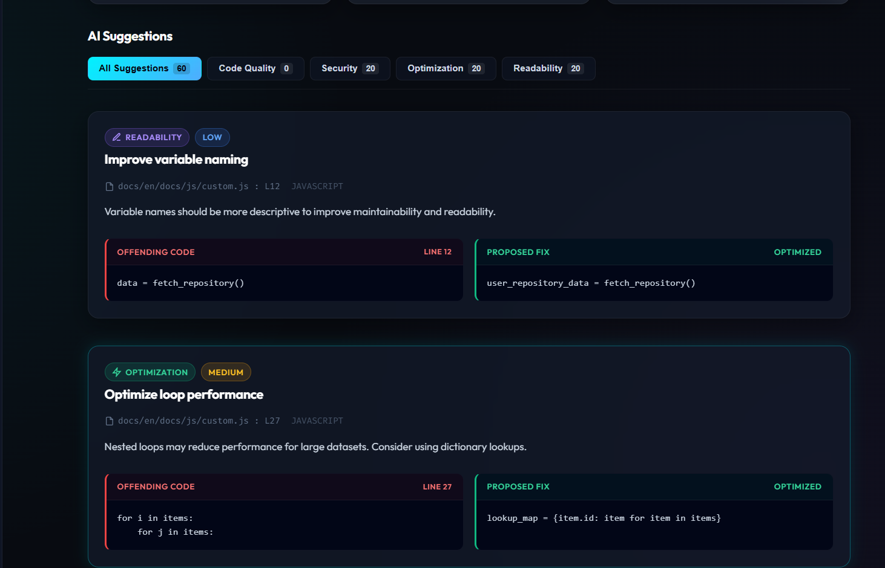

# ai-github-code-reviewer
ReviewAgent 🤖 | AI-Powered GitHub Code Review Assistant
An AI-powered code review tool that automatically clones a public GitHub repository, scans its source files, and generates detailed code review suggestions using Google Gemini via LangChain.

## Features

- **Automatic repository analysis** - Submit a public GitHub URL, and the backend clones (shallow, `depth=1`), crawls, and extracts supported source files automatically.
- **AI-powered review suggestions** - Each analyzed file is reviewed by Gemini (`gemini-2.5-flash`), returning issues categorized as `security`, `readability`, `optimization`, or `code_quality` with `HIGH` / `MEDIUM` / `LOW` severities.
- **Background task pipeline** - Analyses run asynchronously via FastAPI `BackgroundTasks`; the frontend polls the status every 2 seconds and shows live progress.
- **Persistent history** - All reviews and their suggestions are stored in a database (SQLite by default, PostgreSQL via Docker Compose) and accessible via the dashboard.
- **Guardrails** - Configurable limits (`MAX_FILES_TO_ANALYZE`, 100 KB per-file cap) prevent long execution times and token exhaustion.
- **Cleanup** - Temporary cloned repositories are automatically deleted after analysis.

## Tech Stack

| Layer      | Technology |
|------------|------------|
| Backend    | Python 3.11, FastAPI, Uvicorn, SQLModel, GitPython, google-generativeai |
| Frontend   | React 19, Vite 8, Axios |
| Database   | PostgreSQL 15 (Docker) / SQLite (local dev) |
| AI         | Google Gemini 2.5 Flash |
| Infra      | Docker Compose, GitHub Actions CI/CD |

## Architecture

```
                      +----------------------+
                      |  React + Vite UI     |   (http://localhost:5173)
                      +----------------------+
                                 |
                          axios / REST
                                 |
                      +----------------------+
   POST /api/analyze  |  FastAPI Backend     |   (http://localhost:8000)
   -----------------> |  BackgroundTasks     |
                      |  +------------+      |
                      |  | GitPython  | ---> shallow clone repo
                      |  | extractor  |      + crawls .py/.js/.jsx/.ts/.tsx/.java
                      |  +------------+      + ignores node_modules, venv, build...
                      |  +------------+      |
                      |  | Gemini     | ---> per-file JSON review issues
                      |  | reviewer   |      + categories & severities
                      |  +------------+      |
                      |  +------------+      |
                      |  | SQLModel   | ---> persist analysis + suggestions
                      |  +------------+      + cleanup cloned repo
                      +----------------------+
                                 |
                      +----------------------+
                      |  PostgreSQL          |   (Docker only)
                      +----------------------+
```

## Screenshots

### Dashboard Overview



### AI Suggestions



## Getting Started

### Option 1: Docker Compose (recommended)

Requires [Docker](https://www.docker.com/products/docker-desktop/) and `docker compose` (v2).

```bash
# 1. Create a .env file with your API key
echo "OPENAI_API_KEY=your_key_here" > .env

# 2. Build and start all services
docker compose up --build
```

- Frontend: http://localhost:5173
- Backend API docs (Swagger UI): http://localhost:8000/docs
- PostgreSQL runs on port `5432`

### Option 2: Local development

**Backend**

```bash
cd backend
python -m venv venv
venv\Scripts\activate            # Windows (use `source venv/bin/activate` on macOS/Linux)
pip install -r requirements.txt

# Create .env from the template and set your key
copy .env.example .env           # Windows (use `cp .env.example .env` on macOS/Linux)

uvicorn app.main:app --reload --port 8000
```

**Frontend**

```bash
cd frontend
npm install
npm run dev
```

Then open http://localhost:5173.

## Environment Variables

| Variable            | Description                                  | Default                              |
|---------------------|----------------------------------------------|--------------------------------------|
| `GEMINI_API_KEY`    | Google Gemini API key (required by the AI reviewer) | -                              |
| `DATABASE_URL`      | SQLAlchemy database URL                      | `sqlite:///./codereview.db`          |
| `PORT`              | Backend port                                 | `8000`                               |
| `HOST`              | Backend bind host                            | `0.0.0.0`                            |
| `MAX_FILES_TO_ANALYZE` | Max source files scanned per repository   | `20`                                 |
| `VITE_API_URL`      | Frontend-only: backend base URL              | `http://localhost:8000`              |

> Note: When running with Docker Compose, `DATABASE_URL` is injected automatically
> (`postgresql://postgres:postgres@db:5432/codereview`).

> Note: The AI reviewer (`backend/app/reviewer.py`) reads `GEMINI_API_KEY` from
> `.env`. Even in Docker, mount or declare `GEMINI_API_KEY` for the backend service.

## API Endpoints

| Method | Endpoint                  | Description                                              |
|--------|---------------------------|----------------------------------------------------------|
| POST   | `/api/analyze`            | Submit a public GitHub URL; returns a `PENDING` analysis |
| GET    | `/api/analyses`           | List all analysis records                                |
| GET    | `/api/analyses/{id}`      | Get one analysis with all AI suggestions                 |
| DELETE | `/api/analyses/{id}`      | Delete an analysis and its suggestions                   |

### Example request

```bash
curl -X POST http://localhost:8000/api/analyze \
  -H "Content-Type: application/json" \
  -d '{"repo_url": "https://github.com/psf/requests"}'
```

### Example suggestion item

```json
{
  "line_number": 10,
  "category": "security",
  "severity": "HIGH",
  "title": "SQL Injection Risk",
  "description": "User input is directly used in query.",
  "suggestion_code": "Use parameterized queries",
  "original_code": "SELECT * FROM users WHERE id = " + user_input
}
```

## Supported File Types

The analyzer scans: `.py`, `.js`, `.jsx`, `.ts`, `.tsx`, `.java`

It skips directories like `node_modules`, `venv`, `build`, `dist`, `.git`, and ignores files larger than 100 KB.

## CI/CD

A GitHub Actions workflow (`.github/workflows/ci-cd.yml`) runs on every push/PR to `main` and `master`:

1. **Backend** - installs dependencies, checks formatting with Black, and lints with Flake8.
2. **Frontend** - installs dependencies and validates the production build.
3. **Docker** - validates the `docker-compose.yml` configuration.

## Project Structure

```
├── backend/                  # FastAPI application
│   ├── app/
│   │   ├── main.py           # API routes & background pipeline
│   │   ├── reviewer.py       # Gemini review logic
│   │   ├── git_utils.py      # Repo cloning, crawling, cleanup
│   │   ├── crud.py           # Database operations
│   │   ├── models.py         # SQLModel tables
│   │   ├── schemas.py        # Pydantic request/response models
│   │   ├── config.py         # Settings via pydantic-settings
│   │   └── database.py       # Engine & session setup
│   ├── Dockerfile
│   └── requirements.txt
├── frontend/                 # React + Vite UI
│   ├── src/
│   │   ├── App.jsx           # Main layout, state, polling logic
│   │   └── components/       # RepoInput, Dashboard, AnalysisHistory, SuggestionCard
│   ├── Dockerfile
│   └── package.json
├── assets/                   # Project screenshots & CI config
├── docker-compose.yml        # db + backend + frontend orchestration
└── README.md
```

## License

This project is for educational and demonstration purposes.
